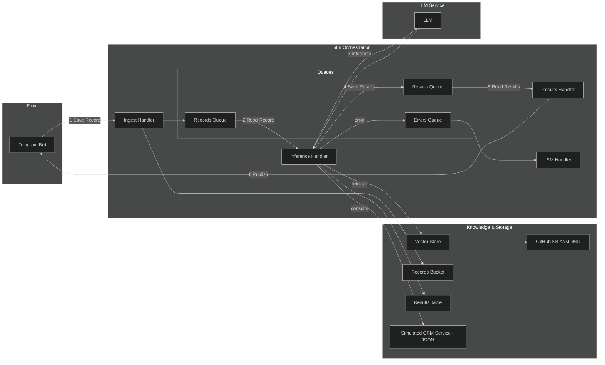
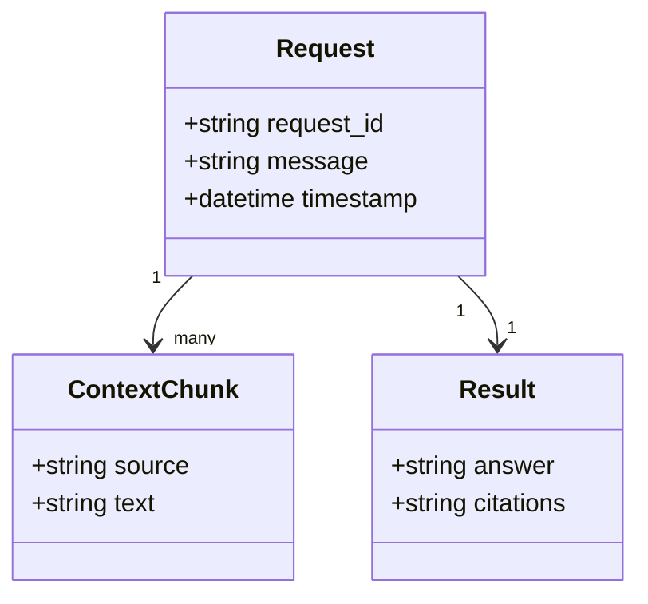
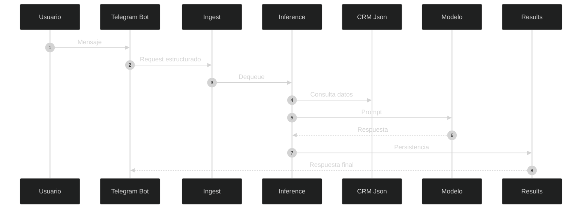

# SOLUTION_ARCHITECTURE.md

## Diseño de Arquitectura – Agente Conversacional (MVP)

Este documento describe la arquitectura técnica del agente conversacional diseñado para asistir a técnicos de campo en consultas relacionadas con información del cliente y portafolio contratado, utilizando un enfoque RAG (Retrieval Augmented Generation) y un CRM simulado.

**Nota de atribución:**  
Este diseño ha sido producido por el **equipo de desarrollo del agente**, con fines académicos, estructurales y evolutivos. Puede ser reutilizado y extendido siguiendo principios de arquitectura desacoplada y buenas prácticas en IA aplicada.

---

## 1. Contexto y Propósito de la Arquitectura

El agente conversacional nace para resolver una necesidad concreta: permitir que un técnico en campo consulte información del cliente (por ejemplo: velocidad contratada, decodificadores, addons, etc.) sin necesidad de acceder directamente a sistemas internos o interfaces complejas.  
En lugar de interactuar con un asesor humano o una plataforma tradicional, el técnico simplemente conversa por Telegram y el agente responde consultando la base de conocimiento y datos del CRM simulado.

Este diseño permite:
- acelerar la respuesta,
- reducir fricción de uso,
- probar lógica de extremo a extremo sin depender de infraestructura productiva,
- y establecer las bases para una futura integración con sistemas reales.

---

## 2. Diagrama General de Arquitectura

Antes del diagrama es importante entender que cada componente participa en una etapa distinta del flujo: entrada (front), procesamiento (orquestación), conocimiento (datos), y respuesta (modelo + front).

---

## 3. Alcance de la Arquitectura

Esta arquitectura cubre el flujo de extremo a extremo desde la llegada del mensaje en Telegram hasta la respuesta contextualizada. Incluye:
- Integración con canal conversacional (Telegram).
- Orquestación con n8n.
- Manejo de colas internas.
- Recuperación de contexto desde KB (base de conocimiento) y CRM simulado.
- Inferencia mediante LLM.
- Persistencia mínima para auditoría.
- Gestión básica de errores.

No cubre (por ahora):
- métricas en tiempo real,
- integración con CRM productivo,
- seguridad avanzada,
- fallback multi-modelo.

---

## 4. Capas de la Arquitectura

La solución se organiza en capas para separar responsabilidades y facilitar la evolución futura:

1. **Front (Interfaz conversacional)** – Recibe y entrega la interacción del usuario.
2. **Orquestación (n8n)** – Coordina el flujo; decide qué se hace con cada request.
3. **Conocimiento y Datos** – Aporta información estática y dinámica.
4. **Modelo (LLM Service)** – Genera la respuesta final con base en el contexto.

---

## 4.1 Capa Front (Telegram)

La capa front administra la entrada y salida de mensajes.
Su único rol es exponer un canal simple, familiar y accesible para el técnico.

| Componente | Rol | Propósito |
|------------|-----|------------|
| Telegram Bot | Interfaz | Punto de entrada/salida de la conversación |

---

## 4.2 Capa de Orquestación (n8n)

Es el núcleo lógico del agente. Aquí ocurren los cambios de estado del mensaje, la preparación del contexto y la invocación del modelo.

| Componente | Función | Responsabilidad |
|-----------|---------|------------------|
| Ingest Handler | Recepción y normalización | Convierte mensaje en `request` estructurado |
| Queues | Regulación del flujo | Desacople y resiliencia |
| Inference Handler | Recuperación + construcción del prompt | Une KB + CRM |
| Results Handler | Publicación final | Devuelve la respuesta a Telegram |
| ISM Handler | Gestión de fallos | Supervisión y retry |

---

## 4.3 Capa de Conocimiento y Datos (Github)

Esta capa asegura que el agente no “invente” respuestas, sino que consulte fuentes confiables.

| Componente | Rol | Descripción |
|-----------|-----|-------------|
| GitHub KB | Conocimiento institucional | Markdown/YAML versionado |
| Vector Store | Recuperación semántica | Indexa embeddings |
| Records Bucket | Historial | request/raw persistido |
| Results Table | Auditoría | Respuesta final |
| Simulated CRM JSON | Dato dinámico | Mock API contract-first |

---

## 4.4 Capa de Modelo (LLM Open AI)

Aquí se genera la respuesta final.
El modelo no “sabe” nada por sí mismo: su criterio se alimenta con contexto recuperado (RAG).

---

## 5. Cómo se conectan las capas

Cada capa responde una pregunta arquitectónica:

| Capa | Pregunta |
|------|----------|
| Front | ¿Qué dice el usuario? |
| Orquestación | ¿Qué debe hacerse con esto? |
| Conocimiento | ¿Qué contexto necesito? |
| Modelo | ¿Cómo lo respondo? |

---

## 6. Flujo de datos (artefactos)

---

## 7. RACI

| Actividad | Responsable | Apoyo |
|-----------|------------|--------|
| Captura | Telegram | n8n |
| Normalización | Ingest | — |
| Recuperación | Inference | KB + CRM |
| Generación | LLM | Inference |
| Publicación | Results Handler | Telegram |
| Fallos | ISM | Orquestación |

---

## 8. Escalabilidad futura

- Colas pueden migrar a Redis/RabbitMQ
- CRM simulado → API real sin refactor
- KB versionada → pipelines de embeddings
- Observabilidad → request tracing
- Fine-tuning → solo para estilo, no para facts

---

## 9. Flujo End-to-End (Vista Narrativa + Técnica)

Cuando el técnico envía un mensaje, se genera un `request` que ingresa por Telegram y es recibido por el Ingest Handler. Ahí se normaliza, se encola y queda listo para ser procesado. El Inference Handler lo toma cuando hay capacidad, consulta la KB (GitHub) y el CRM simulado, construye el prompt con contexto relevante y lo envía al LLM. La respuesta generada se guarda temporalmente y luego el Results Handler la publica de nuevo en Telegram.

Esta secuencia permite desacoplar lectura, recuperación, inferencia y publicación, evitando bloqueos y permitiendo resiliencia.

---

## 10. Versión ejecutiva resumida

- El usuario envía una solicitud.
- Se convierte en `request` estructurado.
- Se encola y se espera disponibilidad.
- Se consulta conocimiento (KB) + CRM.
- El LLM genera la respuesta final.
- Se publica en Telegram.

---

## 11. Tabla de transiciones

| Paso | Acción | Origen | Destino |
|------|--------|--------|---------|
| 1 | Save Record | Front | Orquestación |
| 2 | Enqueue | Ingest | Records Queue |
| 3 | Dequeue | Queue | Inference |
| 4 | Retrieval | Inference | KB/Vector Store |
| 5 | Lookup | Inference | CRM JSON |
| 6 | Inferencia | Inference | LLM |
| 7 | Save Result | Inference | Results Queue |
| 8 | Publish | Results | Front |

---

## 12. Manejo de errores

El ISM Handler escucha fallas y deriva a `Errors Queue`.  
Soporta:
- reintentos,
- trazabilidad,
- degradación controlada.

---

## 13. Rol del CRM simulado

El mock JSON funciona como contrato API para una futura integración real.  
Esto permite probar sin infraestructura y sin cambios cuando se conecte el CRM productivo.

---

## 14. Tradeoffs técnicos

| Decisión | Beneficio | Costo |
|----------|-----------|--------|
| RAG | Conocimiento vivo | mayor gobernanza |
| JSON CRM | desacople extremo | sin latencia real |
| n8n | visual y orquestado | menor throughput |

---

## 15. Evolución arquitectónica

- Redis/RabbitMQ para colas externas
- Observabilidad → métricas por etapa
- API CRM real
- múltiples dominios futuros

---

## 16. Cierre

La arquitectura no es un “chatbot”, sino un sistema conversacional desacoplado y versionado, capaz de evolucionar sin reescritura. El equipo de desarrollo puede extender capacidades sin comprometer estabilidad.

---

## 17. Anexo A – Flujo formal

---

## 18. Cómo ejecutar (MVP)

1. Clonar el repositorio.
2. Configurar el bot de Telegram y token.
3. Conectar n8n a Telegram Webhook.
4. Crear los nodos Ingest → Queue → Inference → Results.
5. Montar JSON CRM en GitHub.
6. Ejecutar flujo y probar.

---

