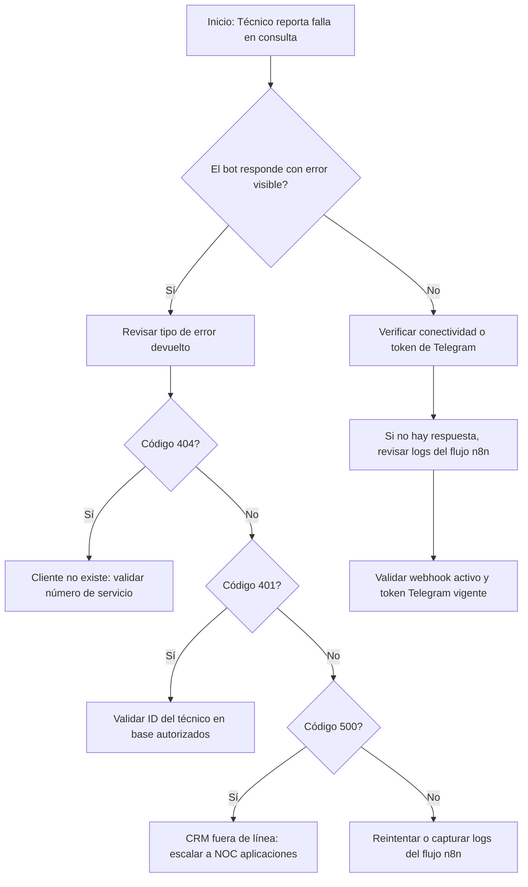

# Falla

El técnico no recibe respuesta del bot o el sistema devuelve error durante la consulta de portafolio del cliente.

---

# Objetivo

Guiar al técnico y al analista de soporte para identificar rápidamente si la falla proviene del bot, del flujo n8n o del CRM, y definir las acciones correctivas.

---

# Árbol de decisión

